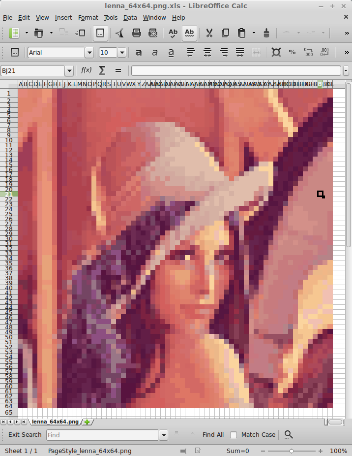
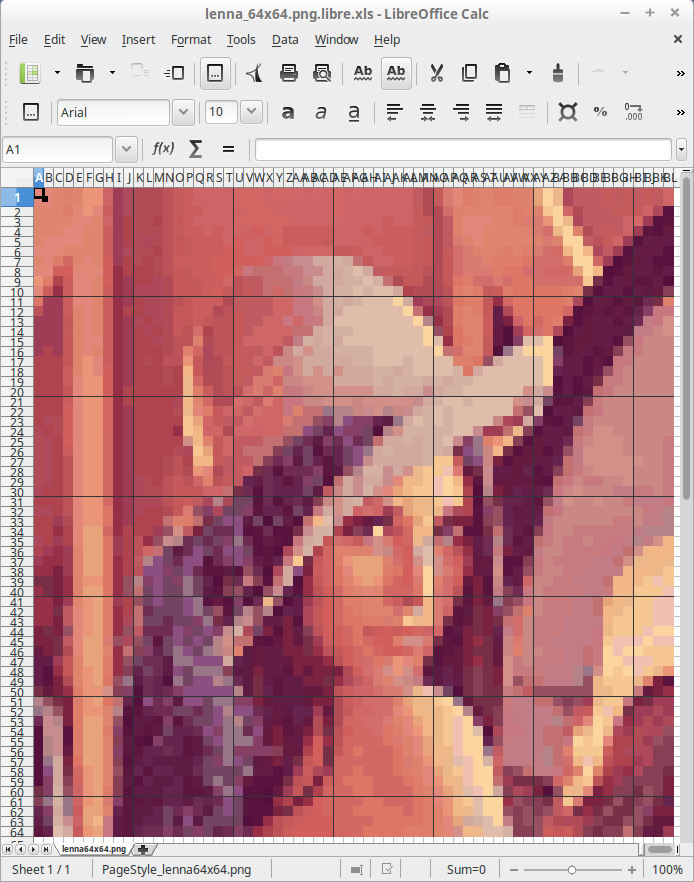

# img2xls
Convert images to colored cells in an Excel spreadsheet.

## Install dependencies

    pip3 install Pillow
    pip3 install xlwt3

## Usage

    usage: img2xls.py [-h] [--grid GRID GRID] {libre,ms,mac} image

    positional arguments:
      {libre,ms,mac}    Choose the office package to use. | libre -> LibreOffice
                        xls | ms -> Microsoft Office xls | mac -> Mac Office xls
      image             Image which should be converted intoa spreadsheet

    optional arguments:
      -h, --help        show this help message and exit
      --grid GRID GRID  Adds a grid to the resulting spreadsheet. Numbers
                        represent the number of pixels between vertical and
                        horizontal grid lines, respectively. 0 (zero) means no
                        grid on this axis.

### Example

    python3 img2xls.py libre image.png

image.png.libre.xls will be created.

---------------------------------------

If you want a grid in the resulting spreadsheet,
you can pass the --grid option, as follows:

    python3 img2xls.py libre --grid vertical_gap_in_px horizontal_gap_in_px image.png

Both values have to be specified. If you don't want grid lines on an axis just set this value to 0. Negative values are ignored.

